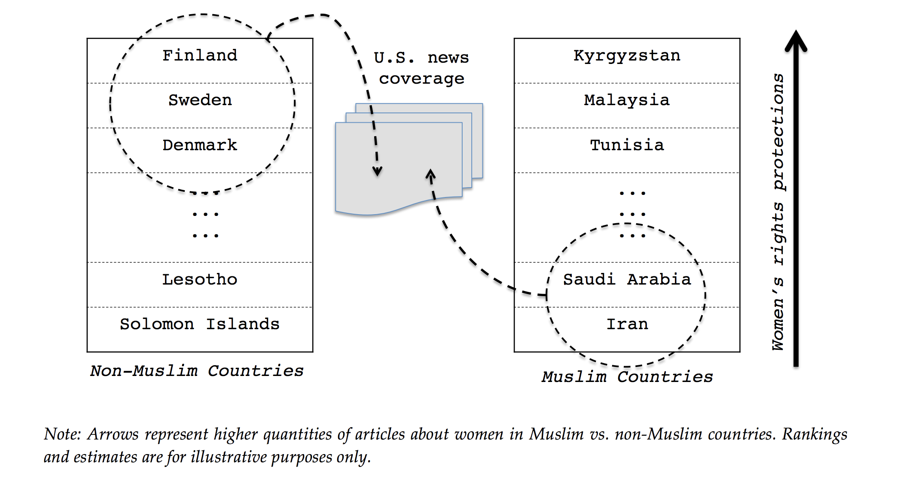
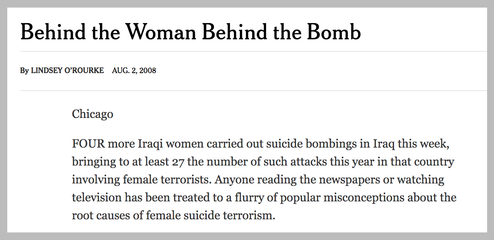

\captionsetup[table]{labelformat=empty}

```{r libraries, include=FALSE}
rm(list=ls())

library(tidyverse)
library(dplyr)

require(plyr)
require("MASS")
require("xtable")
require(plm) # panel data operations
require(ggplot2) # visualizations
require(stargazer) # pretty tables
require(sandwich) # for robust standard errors
require(lmtest) # for robust standard errors
require(sampleSelection) # for heckman correction
require(mfx) # for marginal effects
require(Matching) # required by the interaction_plots.R script below
require(stm)
library(scales)
library(countrycode)
library(gt)
library(xaringan)
source("dataverse_files/interaction_plots.R") # for interaction plots; see paper for attribution

# Load Data
load("dataverse_files/stm.RData")

```

# Abstract

Does news content by United States news organizations assert western cultural and political superiority over muslim countries? In her paper, *An Analysis of Islamophobia and Media Portrayals of Muslim Women: A Computational Text Analysis of US News Coverage* [@terman], Rochelle Terman analyzes this claim. She determines that US news coverage of women abroad is driven by confirmation bias, whereby journalists are more likely to report on women living in Muslim and Middle Eastern countries if their rights are violated, but will report on women in other societies when their rights are respected. She uses 35 years of New York Times and Washington Post data to analyze this claim, and determines that U.S. Media spreads the perception that Muslims are distinctly sexist. I hypothesise that this result could be due in part to unmeasured confounding by terrorism. To test this hypothesis, I control for war & terrorism in two seperate ways: I remove countries that the United States is involved in active military confilct with, and I remove articles whos content is related to terrorism. I find that by removing countries at war with the United States, the magnitude of Terman's results is reduced by 33%.

# Introduction

#### Cultural Threat
Why has public hostility towards muslims been on the rise in the United States? The link between Muslims and terrorism has been considered a leading cause of this hostility. However, research suggest that the perception of Muslims as a *cultural* threat may be more significant than their association with terrorism. A cultural threat signifies that people, in this study refering to people in the U.S., would view them as being culturally inferior or incompatible. While studies have examined origins of this perception in media portrayals, few studies have examined how this perception as a cultural threat originates in media portrayals. 

Orientalism refers to the representation of Asia with a colonialist attitude. Gendered Oritentalism refers to the study of orientalism with a specific focus on women. It draws on theories that state that one mechanism of enforcing a colonial attitude is to paint the treatment of women in another society as inferior. Since 9/11, this has become an increasingly popular area of research as people have suspected this form of orientalism to be increasing along with the War on Terror. Terman's study examines the theory of gendered orientalism and its application in the Middle East. She identifies the media's role in perpetuating the stereotype of Muslims as a *cultural* threat, specifically focusing on representations of women and gender inequality in the Middle East. 

#### Terman's Hypothesis
Using 35 years of New York Times and Washington Post news archives, Terman analyzes the origins of *cultural* threat regarding the representations of women and gender inequality and has two hypothesis: 
\newline

* Quantity Hypothesis: The sepertion of Muslim women from "freer" western women (i.e. pushing this narritive). Muslim women from countries with poor women's rights records are reported upon more frequently, while the opposite holds for women from non-muslim countries.

## Figure 1: Quantity Hypothesis (Figure drawn directly from Terman's paper)



* Quality Hypothesis: Quality / Framing Hypothesis: U.S. media coverage of women in Muslim and Middle Eastern countries is obsessed about one issue in particular: women’s rights and gender (in)equality.

For the sake of this paper, we focus on analyzing Terman's findings regarding the quantity hypothesis (Which will now be referred to as the "hypothesis").

#### 9/11 and Terrorism
Generally speaking, Americans view Muslims much less favorably than other religious and racial minorities (Pew Research Center 2014). The disfavor is most commonly viewed as being due to the connection between Muslims and terrorism, largely attributed to the attacks on 9/11 and the subsequent War on Terror. Terman's work studies whether the news we read may also be a factor in this disfavor. 

#### Anlaysis of Terman's Hypothesis Accounting for War and 9/11
9/11 and terrorism are clearly driving forces in the disfavor of people from the U.S. towards Muslim countries, and also relavent to Terman's research into gendered orientalism. I plan to analyze the role of war and terrorism in Terman's Quantity hypothesis. I have the following two hypotheses: \newline
1. **War Hypothesis**: I hypothesize that Terman's results are partly driven by coverage of war zones, and thus by removing countries at war with the US it will lessen the magnitude of her results.\newline
2. **Terrorism Related Content**: I hypothesize that Terman's results are partly driven by coverage of terrorist acts, and thus by removing articles related to terrorism it will lessen the magnitude of her results.

# Materials and Methods

#### Terman Study Data

- **News Data**: News data is drawn from the LexisNexis databse. All articles containing the subject term “women” in non U.S. countries, published in the New York Times and Washington Post, 1980–2014 were downloaded. Each article is assigned to a single country with its most salient country term, if the term has a relevance score greater than or equal to 85% - articles with a lower relavence score, or with a country country focus of the United States are discarded. A total of 4531 documents were included: 3726 from the New York Times and 805 from the Washington Post. \newline 

- **Country data**: All current and historic UN states were included with the addition of Palestine and exclusion of the United States. The United States was excluded as the study focuses on US news coverage of foreign countries, so it is outside of the scope of the study. Countries are labelled by their Correlates of War codes, labeled *ccode*. 

- **Country-Year data organization**: Data is aggregated into country-year datasets, in which there is a row for each year and country (total number of countries x total number of years = total number of rows). Each country-year data includes the variables *count*, *n.count* and *n.binary*. *n.count* indicates the number of articles matching the criteria written about that country in that given year, *n.binary* is a binary indicator variable which equals 0 if no articles were written in that given year and 1 if at least 1 article was written in that given year. *count* indicates the total number of articles written about that country in a given year (over all topics, not just related to women). *n.docs* and *count* both have a mix of NA values and 0 values. I change all NA values to 0 for consistency.

- **Muslim Indicators**: Three seperate markers were used to indicate whether a country is or is not a muslim country. The first is the *Percentage Muslim* variable, indicating the percentage of muslims in a country (Drawn from Pew Research Center Data 2011). The second, *Muslim Majority*, is a binary indicator of 1 or 0, with value 1 when *Percentage Muslim* is greater than or equlal to 50%, and value 0 otherwise. The third is a set of regional groupings loosely based on Hafner-Burton and Ron’s (2013) six regional groupings (In which *MENA* indicates the Middle East and North Africa). When examining this data, it becomes clear that some countries experience fluctuations of muslim percentage of greater than 50% of the country's population. While this initially seems impossible, after further investigation all but one countries fluctuations can be attributed to declerations of independence. The one country where this does not hold is for Palestine. Terman assigns a new code to Palestine at the beginning of the paper, which causes it to share the same code as another country. While this skews the data under examination, the manner in which the models use the data causes this not to affect any of the outcomes. \newline 

- **Women's Rights**: Women's Rights score is given on a scale of 0 to 3, where 3 indicates the women's rights were best guaranteed by law and practice and 0 indicates that womens rights were not guaranteed in law nor practice. This score is drawn from the Cingranelli-Richards Rights Index (CIRI), which culls data from the U.S. State Department’s annual human rights country reports. The CIRI score gives three variables, Women’s Economic Rights, Women’s
Political Rights, and Women’s Social Rights, of which the mean is taken to create the variable *Composite Women's Rights*.\newline

- **Country Reports**: Country Reports (refers to the *count* variable described above) data relates to the overall quantity of articles related to a country reported by the NYT in a given year. There are around 8 points in this dataset (< 1% of the data) where the # of articles about women (n.docs) is listed as being larger than the total number of documents (count), which indicates that the data is not perfect. I filtered these instances out of the data.

- **Democracy**: Democracy data is drawn from the Polity IV dataset’s Polity2 index. It is used to control for the level of autocracy in a country (i.e. it could be difficult to report on women in highly autocratic or restrictive regimes). This varaible ranges from –10 (most autocratic) to +10 (most democratic).

- **Instability**:  Instability data is taken from the Banks CrossNational Time Series Data Archive composite index of political instability. It include indicators regarding riots, antigovernment protests, guerrilla attacks, general strikes, purges, government crises, and assassinations.

- **GDP per Capita**: GDP per capita data drawn from World Bank Development Indicators.

- **log(Population)**: Population data drawn from the United Nations and logged.

#### Extension Data 

- **NAW Countries**: I create a new dataset which discards articles regarding countries that the US is currently in active military conflict with. I label these countries NAW (Not At War) countries. The countries that are excluded are Afghanistan, Iraq, Syria, Yemen, Somalia, Libya, and Niger (@vice). In the complete data set, there are 6448 country-year datapoints (where each datapoint represents a given country in a given year). After exluding the countries at war with the U.S., there are 6209 country-year datapoints.

- **Terrorism Related Terms**: I remove articles with subjects containing any of the following terms related to terrorism: "terroris" (This matches words like "terrorist" and "terrorism"), "bomb", "attack". This list was created by reading through articles, selecting ones which covered terrorist content, and examining their shared subject tags. In the complete dataset there are 4531 articles. After removing articles with subjects matching the terrorism terms there are 4253 articles.

#### Modeling Methods

Terman uses 2 primary methods of modeling the data: probit model and negative binomial model:\newline

- **Probit Model**: A probit regression is used because we are dealing with a binary variable. The left hand variable in the probit model is *n.binary*, a binary indicator of whethere an article has or has not been written about a country in a given year.

- **Negative Binomial Model**: A negative binomial model is used to model the data with the total count of articles used as the left hand side variable. A negative binomial model is a standard model for use with count data. The total count of articles is right skewed, making negative binomial model an effective choice in this scenario.

# Results

#### Summary of Terman Results

Terman runs two models on the data to analyze the significance of several variables on the probability of having an article written about a given country. Terman first uses a binary article count to account for the right skewing of data and uses a probit analysis of the data (Appendix Table 1). She then uses a full article count and uses a negative binomial analysis of the data (Appendix Table 2). In both cases, we see that all three measures of a country being a "Muslim Country" are significant.

Both her analysis in Appendix Table 1 and Appendix Table 2 demonstrate that a lower women's rights index correlates with a higher probability of having an article written in a muslim country, while a higher women's rights index is correlated with a higher probability of having an article written in a non-muslim country (Appendix Figure 2). This supports her claims from the quantity hypothesis. Terman displays this result in Appendix Figure 2.

#### Hypothesis 1: War Hypothesis

Western media is more likely to report on countries that the U.S. is engaged with in military conflict. We can see in figure 2 that soon after 1990 AW (At War) countries became increasingly more reported on than NAW (Not at War) countries. We can see see in figure 3 that women's rights in the AW countries fell began to fall around 1990. This 1990 period also happens to be the same year as the Gulf War, and directly before Operation Desert Storm (1991).

## Figure 2: Mean Women's Rights Composite Score in Muslim Countries (NAW vs. AW)

```{r figwhyT2, echo=FALSE}

readRDS('./writeup_files/whyTerrorism2.RDS') +
  labs(caption="The mean number of articles on at war countries increases relative to not at war countries around 1990, \n the year of the Gulf War.")

```

## Figure 3: Mean Women's Rights Composite Score in Muslim Countries (NAW vs. AW)

```{r figwhyT1, echo=FALSE}

readRDS('./writeup_files/whyTerrorism.RDS') +
  labs(caption="Women's rights composite score in at war countries decreases around 1990, the year of the Gulf War.")

```

Given the negative correlation between war and womens' rights, and the positive correlation between war and the number of articles published about women in a country, it is reasonable to assume that war could affect Terman's results. In order to test this, I created a new dataset that removed countries at war from the U.S. from Terman's initial dataset labeled NAW (Not at War) data. I then repeated Terman's initial models on the dataset. We first can see the probit and negative binomial models (Tables 1 and 2) on the number of articles published about a given country, including external factors.

\newpage

## Table 1: Probit Analysis of U.S. News Coverage of Women Abroad in NAW Countries

```{r tb1, echo=FALSE, results='asis'}

# Table 1: Probit Analysis
wlogit1 <- readRDS('./writeup_files/wlogit11.RDS')
wlogit2 <- readRDS('./writeup_files/wlogit12.RDS')
wlogit3 <- readRDS('./writeup_files/wlogit13.RDS')
wlogit1.se <- readRDS('./writeup_files/wlogit14.RDS')
wlogit2.se <- readRDS('./writeup_files/wlogit15.RDS')
wlogit3.se <- readRDS('./writeup_files/wlogit16.RDS')

# Print Table 1
stargazer(wlogit1, wlogit2, wlogit3, header=FALSE, label = "table:probit", style = "ajps",  se = list(wlogit1.se, wlogit2.se, wlogit3.se), notes="Robust standard errors clustered on country appear in parentheses.",  dep.var.labels = "Repocountry.yeared (Binary)", covariate.labels=c("Country Repocountry.years", "Women's Rights Index","Muslim Majority","MENA", "Muslim Percentage", "Democracy", "Instability", "Population", "GDP per capita", "Women's Rights x Muslim Majority", "Women's Rights x MENA","Women's Rights x Muslim Percentage"), star.cutoffs = c(0.05, 0.01, .001))

```

\newpage

## Table 2: Negative Binomial Analysis of U.S. News Coverage of Women Abroad in NAW Countries

```{r tb2, echo=FALSE, results='asis'}

# Table 2: Negative Binomial Analysis
wnb1 <- readRDS('./writeup_files/wnb11.RDS')
wnb2 <- readRDS('./writeup_files/wnb12.RDS')
wnb3 <- readRDS('./writeup_files/wnb13.RDS')
wnb1.se <- readRDS('./writeup_files/wnb14.RDS')
wnb2.se <- readRDS('./writeup_files/wnb15.RDS')
wnb3.se <- readRDS('./writeup_files/wnb16.RDS')

# Print Table 2
stargazer(wnb1, wnb2, wnb3, label = "table:negbin", header=FALSE, style = "ajps", se = list(wnb1.se, wnb2.se, wnb3.se), notes="Robust standard errors clustered on country appear in parentheses.",  dep.var.labels = "Reported (Count)", covariate.labels=c("Country Reports", "Women's Rights Index","Muslim Majority","MENA", "Muslim Percentage", "Democracy", "Instability", "Population", "GDP per capita", "Women's Rights x Muslim Majority", "Women's Rights x MENA","Women's Rights x Muslim Percentage"), star.cutoffs = c(0.05, 0.01, 0.001))

```

\newpage

We can see that in both of these models, the expected positive correlation between Muslim Country and article count, and the expected negative correlation between Muslim Country x Women's Rights exist and are statistically significant. We can visualize the magnitude of changes in the primary metric, women's rights effect on coverage in a non-muslim vs. muslim country, by using a binary interaction plot (Figure 4). This figure plots the results of the negative binomial analysis of All Data (Directly from Terman's paper) vs. NAW countries, using *Muslim Majority* as the indicator of a muslim country. The results refer to the results of the first linear model from the negative binomial analyses (NAW data from table 2 & all data from appendix table 2).

## Figure 4: Marginal Effects of Women's Rights Index on Reported (Count). All Countries vs. NAW Countries

```{r fig3, echo=FALSE}

readRDS('./writeup_files/fig3m.RDS') +
  labs(caption = "While confidence intervals still overlap, magnitude of the effect has decreased by 33% using NAW data.")

```

From the marginal effects plot (figure 4) we can see how by limiting the data to countries without warzones (NAW), the magnitude of the effects described by Terman was reduced by around 33%. Also, the confidence intervals of the Non-Muslim Countries now passes below 0, making the conclusion that Women's Rights increase the probability of receiving an article less significant.

#### Hypothesis 2: Terrorism Related Content

In the set of articles there are multiple articles containing content related to specific acts of terrorism or violence. See figure 5 for an example of an article regarding women that relate to terrorist content. 

## Figure 5: Excerpt of New York Times Article



Articles like the one in figure 5 match Terman's criteria of being articles that fall under the category of women. However, it can be assumed that terrorist acts would generally be reported on regardless of location. Given that all of the top 6 countries most affected by terrorism are Muslim majority countries [@forbes], and that the inclussion of terrorism can impact womens' rights, it is reasonable to assume that terrorism could impact Terman's results. I remove articles related to terrorism from the dataset and analyze the data using Terman's methods of analysis. We can see the results in figure 5.

## Figure 6: Marginal Effects of Women's Rights Index on Reported (Count). All Articles vs. NAW Data vs. Excluding Terrorism

```{r fig5, echo=FALSE}

readRDS('./writeup_files/fig4m.RDS') + 
  labs(caption= "Removing terrorism related content shows a negligible effect compared to results using all data.")

```

While there were some minor reductions in the magnitude of the impact of womens' rights on article count in muslim countries, they were negligible compared to the results of removing AW countries. We can further analyze this data by creating a new dataset of NAW countries with terrorism removed (essentially combining hypothesis 1 and 2). We will call this new dataset "NAW Terrorism Removed". The results when modeling this dataset are presented in figure 7.

## Figure 7: Marginal Effects of Women's Rights Index on Reported (Count). All Data vs. NAW / Terrorism Removed Data

```{r fig6, echo=FALSE}

readRDS('./writeup_files/fig5m.RDS') +
  labs(caption="'NAW terrorism removed' demonstrates a 33% decrease in magnitude of effect compared to all data")

```

When including both hypothesis (NAW and no terror), we see a reduction in the magnitude of both of Terman's claims, similiar to that of the NAW data.

# Discussion

My findings suggest that active wars could have an effect on Terman's results, demonstrated by the approximately 33% decrease in both of the effect of Womens' rights on coverage probability in muslim and non-muslim countries when removing AW countries from the dataset. While terrorism related content did not have as large of an effect, it is possible that my techiques for finding and removing content via subject tags were not robust, and that a more extensive process could have yielded better results. 

Were I to further investigate Terman's work, I would be interested in finding indicators of war (in regard to the US) and terrorism that could be properly used to act as indicator variables in the models. For war, one possible indicator could be "# of deployed US soldiers in that specific country" (Assuming that it is a country with active military engagement not a base in a foreign ally's country).

Another interesting trend I found was the increase in articles written about women in countries at war with the US after those wars began. It would be interesting to further examine the data above on a before and after timeline to see how the results of this study change when examining the data before and after conflict (whether it be 9/11 as Terman suggests or the Gulf War and Operation Desert Storm as my data showed) initiated.

# Acknowledgments

I would like to thank David Kane, Mark Hill, and my Gov 1006 class for providing feedback and assistance on the paper. I would also like to thank Rochelle Terman for providing me with extra information that helped me process and work with the data.


\pagebreak

# Appendix

## Table 1: Probit Analysis of U.S. News Coverage of Women Abroad

```{r t1, echo=FALSE, results='asis'}

l1 <- readRDS('./writeup_files/apent11.RDS')
l2 <- readRDS('./writeup_files/apent12.RDS')
l3 <- readRDS('./writeup_files/apent13.RDS')
logit1.se <- readRDS('./writeup_files/apent14.RDS')
logit2.se <- readRDS('./writeup_files/apent15.RDS')
logit3.se <- readRDS('./writeup_files/apent16.RDS')

stargazer(l1, l2, l3, header=FALSE, label = "table:probit", style = "ajps", title = "Probit Analysis of U.S. News Coverage about Women Abroad", se = list(logit1.se, logit2.se, logit3.se), notes="Robust standard errors clustered on country appear in parentheses.",  dep.var.labels = "Repocountry.yeared (Binary)", covariate.labels=c("Country Repocountry.years", "Women's Rights Index","Muslim Majority","MENA", "Muslim Percentage", "Democracy", "Instability", "Population", "GDP per capita", "Women's Rights x Muslim Majority", "Women's Rights x MENA","Women's Rights x Muslim Percentage"), star.cutoffs = c(0.05, 0.01, .001))


```
\pagebreak
## Table 2: Negative Binomial Analysis of U.S. News Coverage of Women Abroad

```{r t2, echo=FALSE, results='asis'}

nb1 <- readRDS('./writeup_files/apent21.RDS')
nb2 <- readRDS('./writeup_files/apent22.RDS')
nb3 <- readRDS('./writeup_files/apent23.RDS')
nb1.se <- readRDS('./writeup_files/apent24.RDS')
nb2.se <- readRDS('./writeup_files/apent25.RDS')
nb3.se <- readRDS('./writeup_files/apent26.RDS')

apent2 <- stargazer(nb1, nb2, nb3, label = "table:negbin", header=FALSE, title = "Negative Binomial Analysis of U.S. News Coverage about Women Abroad", style = "ajps", se = list(nb1.se, nb2.se, nb3.se), notes="Robust standard errors clustered on country appear in parentheses.",  dep.var.labels = "Reported (Count)", covariate.labels=c("Country Reports", "Women's Rights Index","Muslim Majority","MENA", "Muslim Percentage", "Democracy", "Instability", "Population", "GDP per capita", "Women's Rights x Muslim Majority", "Women's Rights x MENA","Women's Rights x Muslim Percentage"), star.cutoffs = c(0.05, 0.01, 0.001))


```
\pagebreak
## Table 3: Summary of Topic Labels

```{r t3, echo=FALSE, results='asis'}

dat <- readRDS('./writeup_files/apent3.RDS')

print(xtable(dat))

```
\pagebreak
## Table 4: Two-Step Analysis of Rights Focus in U.S. News Coverage of Women Abroad

```{r t4, echo=FALSE, results='asis'}

heckit1 <- readRDS('./writeup_files/apent41.RDS')
heckit2 <- readRDS('./writeup_files/apent42.RDS')
heckit3 <- readRDS('./writeup_files/apent43.RDS')
heckit1.se <- readRDS('./writeup_files/apent44.RDS')
heckit2.se <- readRDS('./writeup_files/apent45.RDS')
heckit3.se <- readRDS('./writeup_files/apent46.RDS')

stargazer(heckit1, heckit2, heckit3, header=FALSE,label = "table:heckit", style = "ajps", title = "Two-Step Analysis of Rights Focus in U.S. News Coverage about Women Abroad", se = list(heckit1.se, heckit2.se, heckit3.se), notes="Robust standard errors clustered on country appear in parentheses.",  dep.var.labels = "Rights Focus", covariate.labels=c("Intercept", "Women's Rights Index","Muslim Majority","MENA", "Muslim Percentage", "Democracy", "Physical Integrity Rights"), star.cutoffs = c(0.05, 0.01, 0.001))

```
\pagebreak
## Figure 2: Marginal Effects of Women's Rights Index on Reported (Count)

```{r f2, echo=FALSE}

nb1 <- readRDS('./writeup_files/apen2.RDS')

interaction_plot_binary(nb1, effect="women_composite", moderator="muslim.maj", interaction="women_composite:muslim.maj", factor_labels=c("Not Muslim Majority","Muslim Majority"), xlabel="", ylabel="Marginal Effect of Women's Rights on Coverage", title="")

```
\pagebreak

## Figure 3: Summary of Topic Prevalence

```{r f3, echo=FALSE}

model <- readRDS('./writeup_files/apen3.RDS')

plot.STM(model,type="summary",custom.labels=labels,main="")

```
\pagebreak

## Figure 4: Expected Document Proportions for Four Topics

```{r f4, echo=FALSE}

prep <- readRDS('./writeup_files/apen41.RDS')
regions <- readRDS('./writeup_files/apen42.RDS')

par(mfrow=c(2,2))
# print prevalence graphs for 4 topics
for (i in c(3,7,9,14)){
  plot.estimateEffect(prep,"REGION",method="pointestimate",topics=i,printlegend=TRUE,labeltype="custom",custom.labels=regions,main=labels[i],ci.level=.95,nsims=100)
}

```

\newpage

# References