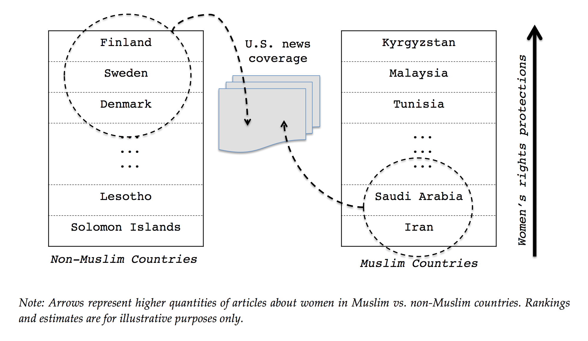
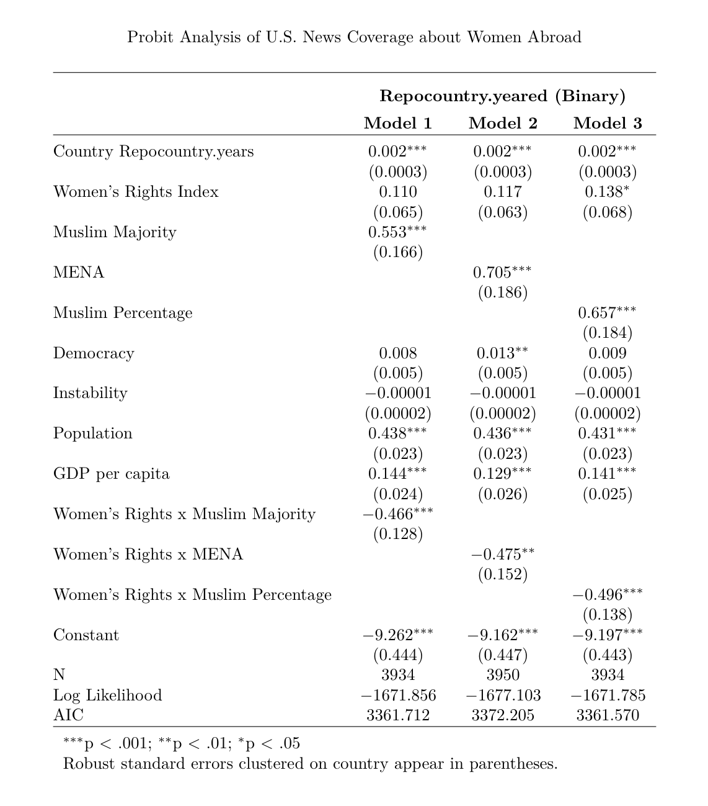
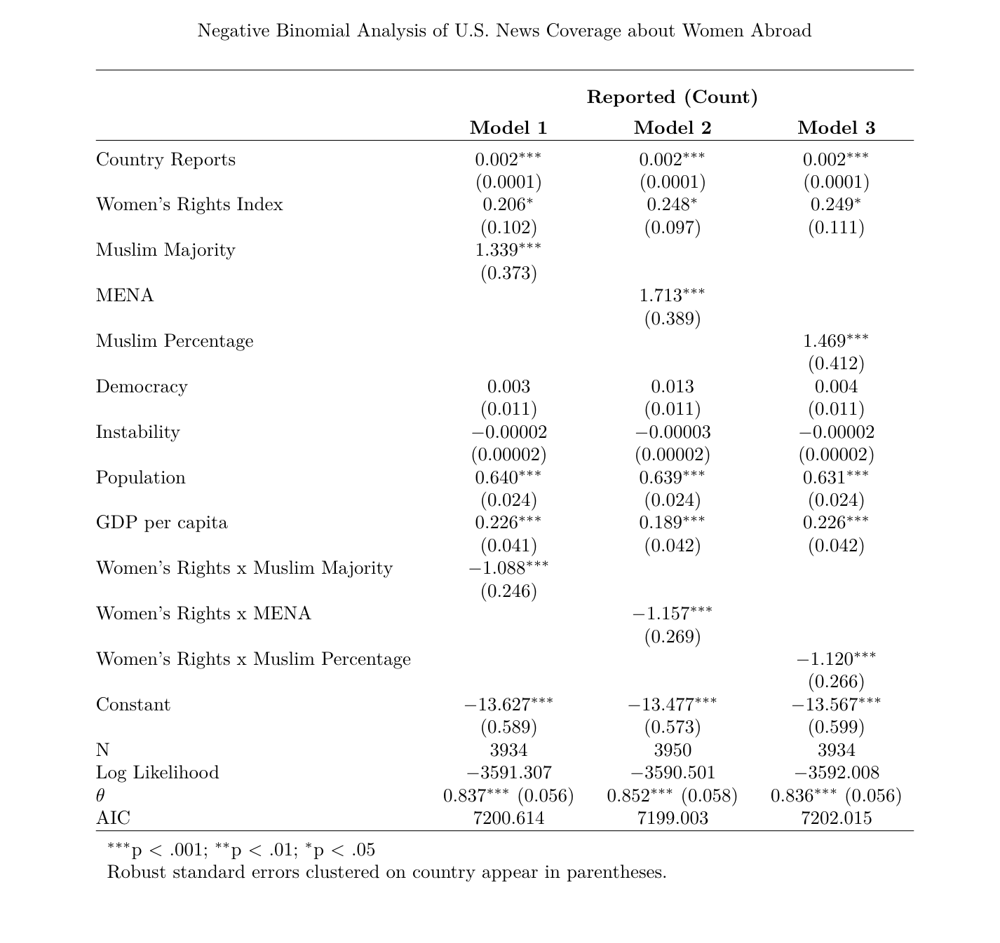
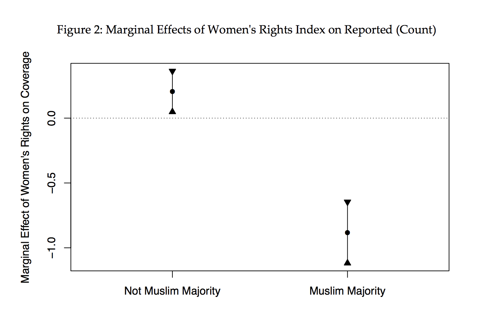
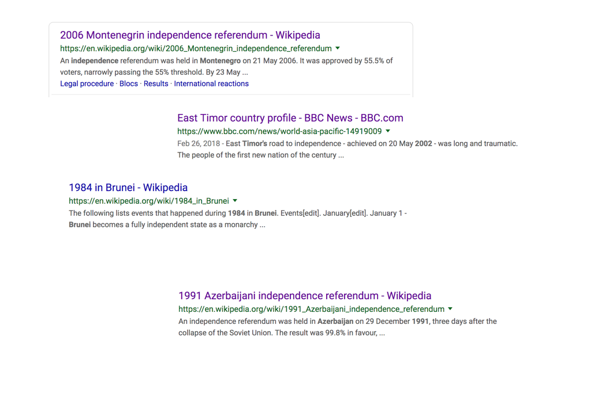
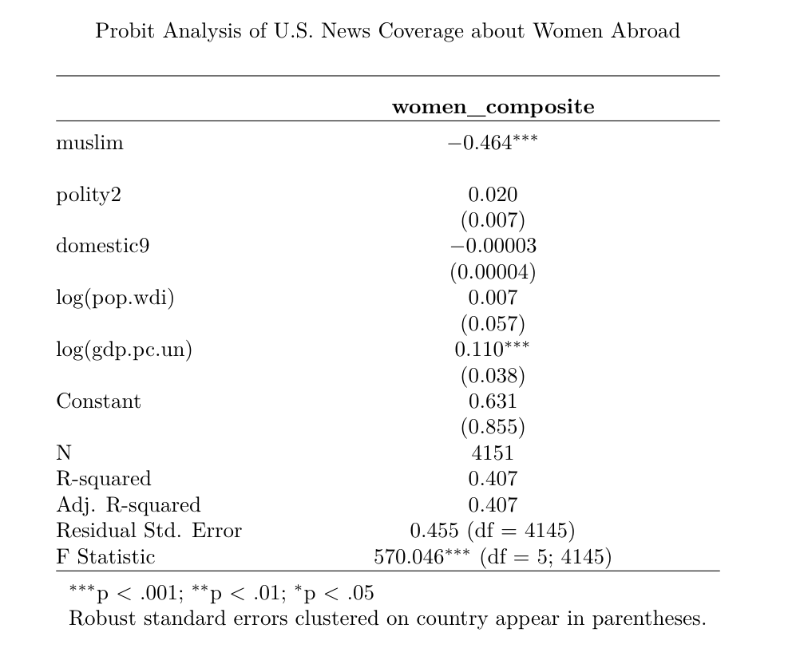

--
---


--
---


--
---

# The Main Point

Current news aims to affirm western cultural and political superiority over muslim countries
 - Gendered orientalism: used poor treatment of women in other countries as a definition
 	of barbaric ways. would use "freeing" these women as a rallying cry.

--
---

# Claims

- Quantity Hypothesis: The binary sepertion of Muslim Women from "freer" western women (i.e. pushing this narritive). So Muslim women from countries with poor rights records make news, while opposite for non-muslim.
- Quality / Framing Hypothesis: U.S. media coverage of women in Muslim and Middle Eastern countries is obsessed about one issue in particular: women’s rights and gender (in)equality. 

--
---

# Quantity Hypothesis 1

--
---

# Quantity Hypothesis 1: Middle East vs. West

```{r loadStuff, include=FALSE}
require(gridExtra)
```


```{r dist12, echo=FALSE, warning=FALSE, fig.width=12}
p1 <- readRDS("./pres_resources/trend_plot.RDS")
p2 <- readRDS("./pres_resources/trend_plot2.RDS")
grid.arrange(p1, p2, ncol=2)
```

--
---


# Quantity Hypothesis 2


--
---
# Quantity Hypothesis 3


--
---


# Choice of Distributions: Continous

```{r dist1, echo=FALSE, warning=FALSE, fig.width=12}

readRDS("./pres_resources/histogram1.RDS")

```

--
---

# Choice of Distributions: Binary

```{r dist2, echo=FALSE, warning=FALSE, fig.width=12}

readRDS("./pres_resources/histogram2.RDS")

```

--
---
# Quantity Hypothesis 4


--
---

# Quantity Hypothesis 1: Middle East vs. West

```{r dist1212312, echo=FALSE, warning=FALSE, fig.width=12}
readRDS("./pres_resources/mus_only.RDS")
```

--
---

# Quantity Hypothesis 1: Middle East vs. West

```{r dist12123, echo=FALSE, warning=FALSE, fig.width=12}
readRDS("./pres_resources/wes_only.RDS")
```

--
---

# Steps to analyze:

####1. Clean Data
- Link the data to country data using COW codes

####2. Analyze Data Quality
- Visualize Data
- Compare Outliers to existing datasets

####3. Test Hypothesis
- What occurs if we look at a non-binary indicator for number of articles?
- What are the non-muslim countries that compare when looking at status of women?
- What happens if we just include percent muslim?

--
---

# Let's analyze some variables

 ####The datapoints we will look at:
 Qualifying Points
    1. Muslim Percentage
    2. Women's rights Index
    3. Democracy
    4. Instability
    5. Population
    6. GDP per Capita

 Left side Variable
    1. Number of articles

--
---

# Muslim Percentage

```{r muslim1, echo=FALSE, warning=FALSE, fig.width=12}

readRDS("./pres_resources/muslim1.RDS")

```

--
---

# Muslim Percentage

```{r muslim2, echo=FALSE, warning=FALSE, fig.width=12}

readRDS("./pres_resources/muslim2.RDS")

```

--
---

# Muslim Percentage

```{r muslim3, echo=FALSE, warning=FALSE, fig.width=12}

readRDS("./pres_resources/muslim3.RDS")

```

--
---

# Muslim Percentage

```{r muslim4, echo=FALSE, warning=FALSE, fig.width=12}

readRDS("./pres_resources/muslim4.RDS")

```

--
---

# Independence



--
---

# Women's Rights Index

```{r women1, echo=FALSE, warning=FALSE, fig.width=12}

readRDS("./pres_resources/women1.RDS")

```

--
---

# Women's Rights Index




